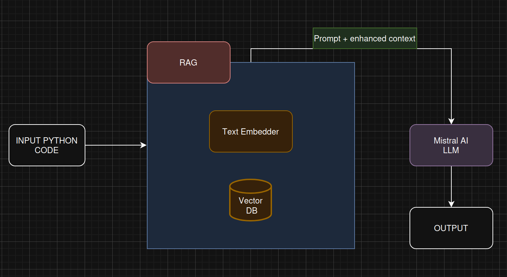

```markdown
# Code Review Agent with RAG

AI-powered Python code analyzer using LangChain, FAISS, and Mistral AI. Analyzes code with optional context from custom PDF documents.

The AI-agent uses easy-customized LLM, input pdf documents so you can adapt agent work for company needs.

```


```

## How It Works
Input Python code -> Text Embedding(using  HuggingFace Embeddings) -> Query and Document embedding store in Vector DB -> LLM gets enhaced prompt -> OutPut

## Quick Start

### 1. Clone & Setup

git clone https://github.com/MMatvei7/Python_LLM_Agent.git

### 2. Configure API Key

Get API key: https://console.mistral.ai

1. Go to https://console.mistral.ai
2. Click "Start Building" button
3. Register for free account
4. Confirm your phone number (required)
5. Navigate to API Keys section
6. Create new API key

Edit `.env` and add your Mistral API key:

```
MISTRAL_API_KEY=your_mistral_api_key_here
CACHE_PATH=faiss_pdf_index
DEFAULT_PDF_FOLDER=pdf_documents
```

### 3. Build Docker Image

```
docker-compose build
```

### 4. Analyze Code

Create or place your Python file in the pdf_documents/ folder, then run:

```
# Quick analysis (LLM only, no RAG)
docker-compose run code-review /app/pdf_documents/test.py --no-rag

# With built-in PDF context
docker-compose run code-review /app/pdf_documents/test.py --rag --default-pdf

# With custom PDFs (place in pdf_documents/ folder)
docker-compose run code-review /app/pdf_documents/test.py --rag --custom-pdf
```

Results saved to `output.txt`

1. **Code Analysis**: LLM analyzes your Input Python code
2. **RAG (Optional)**: Searches PDF documents for relevant context
3. **FAISS Indexing**: Fast semantic search through documents
4. **Caching**: FAISS index cached for speed
5. **Output**: Analysis with source documents

## Commands Reference

| Command | Description |
|---------|-------------|
| `docker-compose build` | Build Docker image |
| `docker-compose run code-review <file> --no-rag` | Analyze without RAG |
| `docker-compose run code-review <file> --rag --default-pdf` | Use built-in PDFs |
| `docker-compose run code-review <file> --rag --custom-pdf` | Use custom PDFs |
| `docker-compose down` | Stop containers |

***

Сохрани это как `README.md` в корне проекта. Это краткий README, который фокусируется на практическом использовании через docker-compose. 🚀
